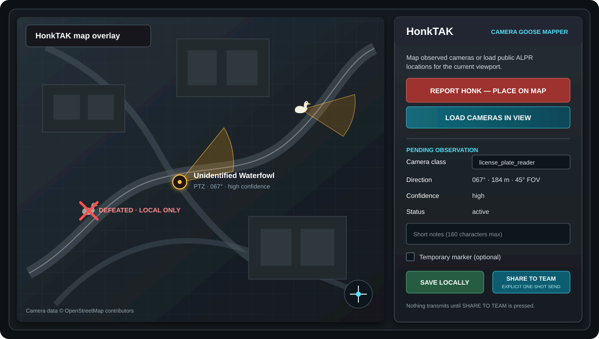
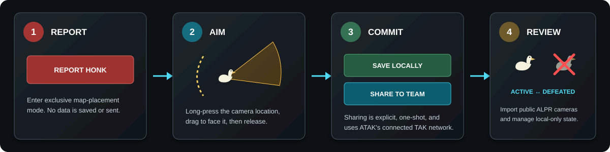

# HonkTAK

**Tactical Goose Awareness for ATAK.** Map observed cameras, visualize their
coverage, import public ALPR camera locations in the current viewport, and
optionally share a completed observation through ATAK's connected TAK network.

<p align="center">
  
  <br>
  <sub>Illustrated from the current v0.2.12 controls and marker states.</sub>
</p>

> [!IMPORTANT]
> Public `main` contains **v0.2.12 development source**. The v0.2.12 GitHub
> release is a source-only prerelease with no APK asset. The validated build
> path is Developer ATAK `5.6.0.CIV` Debug; retail/Play Store ATAK plugin trust
> and on-device gesture behavior are not yet validated.

## What it does

- Places an **Unidentified Waterfowl** marker with a live 45-degree camera
  field-of-view wedge.
- Captures camera class, direction, confidence, status, notes, and observation
  time.
- Saves observations locally by default, permanently unless **Temporary
  marker** is explicitly selected.
- Shares only after the user presses **SHARE TO TEAM**. There are no automatic
  or background sends.
- Loads up to 500 public OSM ALPR camera nodes in the visible map area through
  a user-triggered, bounded Overpass request.
- Lets users mark imported cameras **DEFEATED — LOCAL ONLY**, suppressing their
  wedge and displaying a desaturated goose with a red X. **MARK ACTIVE** undoes
  the local override.
- Restores permanent local observations and imported-camera overrides when the
  plugin reloads.
- Reports `FLOCKPOCALYPSE` when at least three active sightings cluster within
  500 meters.

<p align="center">
  
</p>

## Use HonkTAK

### Report an observed camera

1. Tap HonkTAK's goose tool icon to open the panel, then press **REPORT HONK —
   PLACE ON MAP**.
2. Long-press the camera location on the map.
3. Keep holding and drag toward the direction the camera faces. The live wedge
   shows the true-bearing azimuth and a range clamped to 10–500 meters.
4. Release to open the observation form with the location and direction
   already set.
5. Select the camera class, confidence, and status; optionally add a short note.
6. Leave the marker permanent, or select **Temporary marker** and enter an
   expiry from 1 minute to 7 days.
7. Choose one final action:
   - **SAVE LOCALLY** keeps the observation on this device.
   - **SHARE TO TEAM** sends it once through ATAK's currently connected TAK
     network. If ATAK is disconnected, HonkTAK reports failure and neither
     saves nor sends that attempted shared observation.

Press **CANCEL PLACEMENT** at any point before the final action to restore
normal map interaction without saving or transmitting anything.

### Review public ALPR cameras

1. Pan and zoom to the area you want to inspect. The viewport must span no more
   than one degree of latitude or longitude.
2. Press **LOAD CAMERAS IN VIEW**.
3. Tap or long-press an imported goose marker or its FOV wedge.
4. Use **MARK DEFEATED — LOCAL ONLY** to apply a persistent local override, or
   **MARK ACTIVE** to undo it.

Imported-camera state never writes to OpenStreetMap or DeFlock and never emits
CoT. When a refresh is unavailable, HonkTAK can display the last cached result
for the same viewport as stale data.

## Action and network behavior

| Action | Saves locally | Uses TAK network | Uses Overpass | Writes upstream |
|---|:---:|:---:|:---:|:---:|
| Start, aim, or cancel placement | No | No | No | No |
| **SAVE LOCALLY** | Yes | No | No | No |
| **SHARE TO TEAM** | On successful share | **Yes, once** | No | No |
| **LOAD CAMERAS IN VIEW** | Caches the response | No | **Yes, foreground** | No |
| **MARK DEFEATED / MARK ACTIVE** | Yes | No | No | No |
| **SUBMIT TO DEFLOCK** | Disabled | No | No | No |

HonkTAK uses ATAK's public external CoT dispatcher for team sharing. It does not
open a separate sharing socket or silently retry. The only Android permission
requested by v0.2.12 is `android.permission.INTERNET`, used for the explicit
foreground Overpass read.

HonkTAK does **not** access camera feeds, discover nearby devices, scan
Wi-Fi/Bluetooth, perform recognition, collect contacts or device identifiers,
write mission packages, control UAS systems, or modify upstream OSM/DeFlock
data. Local removal is local only and does not send a remote delete.

## Marker behavior

- Newly placed, restored, inbound, and imported cameras use the same compact
  goose-marker size policy.
- Defeated imported cameras keep their smaller relative scale, desaturated
  styling, red X, and suppressed FOV wedge.
- Incoming validated HonkTAK CoT reconstructs the marker and wedge. Older
  HonkTAK events without range, FOV, or lifetime fields receive bounded legacy
  defaults.
- Explicitly temporary markers and their wedges expire together. Permanent
  markers never inherit a previous temporary duration.

## Build

### Requirements

- Android SDK 36
- Java 17-compatible tooling
- A licensed ATAK `5.6.0.CIV` SDK/devkit stored outside this repository

Create an untracked `local.properties` containing your local SDK and signing
references. Never commit that file or redistribute ATAK SDK material.

```bash
./gradlew assembleCivDebug
```

The repository does not include an ATAK SDK, TAK.gov artifact, UAS Tool
artifact, signing key, or release APK. Do not substitute the public 4.6 devkit
or reverse-engineer the Play Store APK.

## Install for development

Builds are installed manually using the normal ATAK-CIV plugin workflow after
independently verifying the APK hash and signer. A matching Developer ATAK
5.6.0.CIV Debug build is the known development target.

This source snapshot does **not** claim retail ATAK compatibility. A retail or
Play Store ATAK installation can reject a plugin whose signer is not trusted by
that ATAK build.

To remove the plugin, disable or remove HonkTAK from ATAK's **Tool Manager**
when available, then use Android **Settings → Apps → HonkTAK → Uninstall** and
restart ATAK. Uninstalling clears plugin-private local records.

## Validation

The v0.2.12 host gate covers 40 JVM tests plus:

```bash
./gradlew testCivDebugUnitTest lintCivDebug \
  assembleCivDebug assembleCivDebugAndroidTest
```

Coverage includes one-shot share gating, CoT serialization and bounded receive
parsing, placement math, expiry, listener restoration, local persistence,
viewport-bounded import, defeated/active overrides, wedge suppression, marker
scaling, and no-upstream-write behavior.

See [VALIDATION.md](VALIDATION.md) for reproducible host evidence and
[docs/DEVICE_TESTING.md](docs/DEVICE_TESTING.md) for the remaining physical
device checks.

## Source and license

HonkTAK was derived from the public
[`deptofdefense/AndroidTacticalAssaultKit-CIV`](https://github.com/deptofdefense/AndroidTacticalAssaultKit-CIV)
plugin template at commit `889eee292c43d3d2eafdd1f2fbf378ad5cd89ecc`
(tag `4.6.0.5`). Compatibility validation also used a separately supplied ATAK
5.6.0 CIV SDK that is not redistributable and is not included here.

Licensed under `GPL-3.0-only`. See [LICENSE](LICENSE) and [NOTICE](NOTICE).
