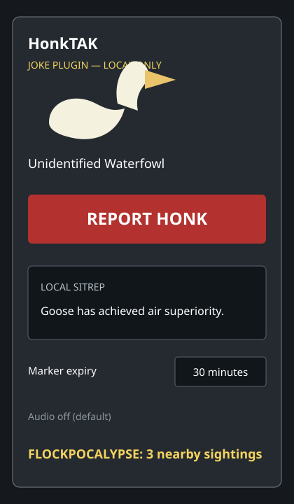

# HonkTAK — Tactical Goose Awareness System

## Release status

Public v0.1.x only. ATAK v5.6.0.12 Play Store rejected the withdrawn
v0.2.0 debug-signed plugin because its signer was not trusted. v0.2.1 is a
private, non-debuggable release candidate and must not be installed or
published until the official TAK plugin signing/registration path and a
separately authorized phone runtime test pass.

Build target: **ATAK v5.6.0.12 Play Store**, Plugin API **5.6.0.CIV**,
Android API **36**. HonkTAK needs no server or configuration for local markers.
**SHARE TO TEAM** uses ATAK's existing TAK connection; when ATAK is
disconnected, HonkTAK states that nothing was saved or sent and performs no
silent retry.

HonkTAK is a clearly labeled joke plugin for ATAK-CIV. v0.2.0 portable source adds user-entered camera-location observations with separate **SAVE LOCALLY** and **SHARE TO TEAM** actions. Sightings use a custom goose icon and **Unidentified Waterfowl** label; they never use friendly, hostile, or other affiliation symbology.



## Network behavior and safety boundary

**SHARE TO TEAM sends the completed observation off-device through ATAK's currently connected TAK network.** It uses the public ATAK external CoT dispatcher—no direct sockets or alternate transport. Transmission occurs only after the user presses the visibly labeled share action; opening the form and saving locally never transmit. Incoming HonkTAK CoT is bounded, validated, and rendered in the HonkTAK overlay.

HonkTAK does not access camera feeds, discover devices, scan Wi-Fi/Bluetooth, perform recognition, collect identifiers/contacts/device IDs, write mission packages, control UAS systems, or mutate real mission data. Local removal is local only and does not send a remote delete. No new Android permission is requested.

## Features

- Four randomized local SITREPs.
- `FLOCKPOCALYPSE` when three active sightings fall within 500 m of any active sighting.
- Camera class, optional azimuth, confidence, status, bounded notes, observed time, and configurable expiry.
- Configurable expiry from 1 minute to 7 days (30 minutes by default); shared CoT stale time and local cleanup match.
- Optional audio setting is disabled by default. v0.1.0 intentionally bundles no audio asset, so the control remains disabled.

## Public source authority

This project was derived from the public `plugin-examples/plugintemplate` in [`deptofdefense/AndroidTacticalAssaultKit-CIV`](https://github.com/deptofdefense/AndroidTacticalAssaultKit-CIV) at commit `889eee292c43d3d2eafdd1f2fbf378ad5cd89ecc`, tag `4.6.0.5`, dated 2024-10-18. Compatibility validation additionally used an authorized ATAK 5.6.0 CIV SDK supplied by the project owner; that SDK is not redistributable and is not included. No TAK.gov SDK, UAS Tool artifact, private package, credential, or signing key is included in this repository.

## Build status

The target is ATAK `v5.6.0.12`, source identifier `9c9a5897`, Play Store build `1769863102`, requiring Plugin API `5.6.0.CIV` on Android API 36. The guarded offline build compiles against the authorized 5.6.0 CIV SDK and declares `com.atakmap.app@5.6.0.CIV`. Runtime loading on Jesse's phone remains untested because this workflow never installs or alters a device.

Build prerequisites are Android SDK 36, Java 17-compatible bytecode tooling, and an owner-authorized ATAK `5.6.0.CIV` SDK/devkit stored outside the repository. Create an untracked `local.properties` with SDK paths and owner-only signing-key references. Never commit it. Do not substitute the public 4.6 devkit, reverse-engineer the Play Store APK, or redistribute private SDK material.

Run only the allowlisted wrapper task:

```text
./gradlew assembleDebug
```

The guarded Society build surface uses `plugin_build(project_path, task=assembleDebug)` and does not install the result.

## Install

Installation is deliberately outside this repository's automated workflow. After independently verifying the APK hash and signer, an authorized operator may install it using their normal ATAK-CIV plugin process. SDK compile compatibility is validated for Plugin API `5.6.0.CIV`; device/runtime compatibility must still be confirmed by a separately authorized installation test.

Expected Android warnings are limited to the source-specific **Install unknown apps** prompt above and the standard package-installer confirmation. A Play Protect scan prompt may also appear depending on the phone's policy. HonkTAK must not be described as runtime-tested or fully installable until ATAK 5.6 accepts its standalone signing certificate and plugin registration during a separately authorized device test.

## Tests

Host-side unit tests cover explicit one-shot share gating, no silent sends, CoT serialization/receive parsing, malformed/oversized/stale/range rejection, expiry, azimuth bounds, local-only construction, and FLOCKPOCALYPSE.

## Uninstall / rollback

In ATAK, remove or disable HonkTAK from **Tool Manager** if that option is available. Then open Android **Settings → Apps → HonkTAK → Uninstall** and restart ATAK. Removing the plugin clears its in-memory overlay on shutdown; its markers are never archived. To roll back to v0.1.0, uninstall v0.2.0 and install the verified v0.1.0 release APK/source package only if it is compatible with the target ATAK build.

## License

GPL-3.0-only, matching the upstream public template. See `LICENSE` and `NOTICE`.
